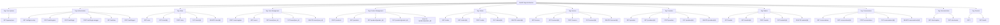

```mermaid
graph TD
    root["FastAPI App Architecture"]
    root --> Core_System["Tag: Core System"]
    Core_System --> Core_System_0["GET /openapi.json"]
    root --> Authentication["Tag: Authentication"]
    Authentication --> Authentication_0["GET /auth/get-real-ip"]
    Authentication --> Authentication_1["POST /auth/register"]
    Authentication --> Authentication_2["POST /auth/login"]
    Authentication --> Authentication_3["POST /auth/login-swagger"]
    Authentication --> Authentication_4["GET /auth/me"]
    Authentication --> Authentication_5["POST /auth/logout"]
    root --> Roles["Tag: Roles"]
    Roles --> Roles_0["GET /roles"]
    Roles --> Roles_1["GET /roles/{id}"]
    Roles --> Roles_2["POST /roles"]
    Roles --> Roles_3["PUT /roles/{id}"]
    Roles --> Roles_4["DELETE /roles/{id}"]
    root --> User_Management["Tag: User Management"]
    User_Management --> User_Management_0["POST /users/register"]
    User_Management --> User_Management_1["GET /users/"]
    User_Management --> User_Management_2["GET /users/{user_id}"]
    User_Management --> User_Management_3["PUT /users/{user_id}"]
    User_Management --> User_Management_4["DELETE /users/{user_id}"]
    root --> Product_Management["Tag: Product Management"]
    Product_Management --> Product_Management_0["POST /products/"]
    Product_Management --> Product_Management_1["GET /products/"]
    Product_Management --> Product_Management_2["GET /products/{product_id}"]
    Product_Management --> Product_Management_3["PUT /products/{product_id}"]
    Product_Management --> Product_Management_4["DELETE /products/{product_id}"]
    root --> Orders["Tag: Orders"]
    Orders --> Orders_0["GET /orders"]
    Orders --> Orders_1["GET /orders/{id}"]
    Orders --> Orders_2["POST /orders"]
    Orders --> Orders_3["PUT /orders/{id}"]
    Orders --> Orders_4["DELETE /orders/{id}"]
    root --> Invoices["Tag: Invoices"]
    Invoices --> Invoices_0["GET /invoices"]
    Invoices --> Invoices_1["GET /invoices/{id}"]
    Invoices --> Invoices_2["POST /invoices"]
    Invoices --> Invoices_3["PUT /invoices/{id}"]
    Invoices --> Invoices_4["DELETE /invoices/{id}"]
    root --> Providers["Tag: Providers"]
    Providers --> Providers_0["GET /providers"]
    Providers --> Providers_1["GET /providers/{id}"]
    Providers --> Providers_2["POST /providers"]
    Providers --> Providers_3["PUT /providers/{id}"]
    Providers --> Providers_4["DELETE /providers/{id}"]
    root --> Models["Tag: Models"]
    Models --> Models_0["GET /models"]
    Models --> Models_1["GET /models/{id}"]
    Models --> Models_2["POST /models"]
    Models --> Models_3["PUT /models/{id}"]
    Models --> Models_4["DELETE /models/{id}"]
    root --> Conversations["Tag: Conversations"]
    Conversations --> Conversations_0["GET /conversations"]
    Conversations --> Conversations_1["GET /conversations/{id}"]
    Conversations --> Conversations_2["POST /conversations"]
    Conversations --> Conversations_3["PUT /conversations/{id}"]
    Conversations --> Conversations_4["DELETE /conversations/{id}"]
    root --> Documentation["Tag: Documentation"]
    Documentation --> Documentation_0["GET /docs/rapidoc"]
    Documentation --> Documentation_1["GET /docs/scalar"]
    root --> General["Tag: General"]
    General --> General_0["GET /"]
    General --> General_1["GET /health"]
```
